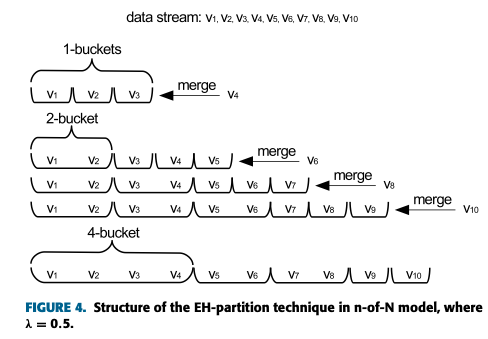
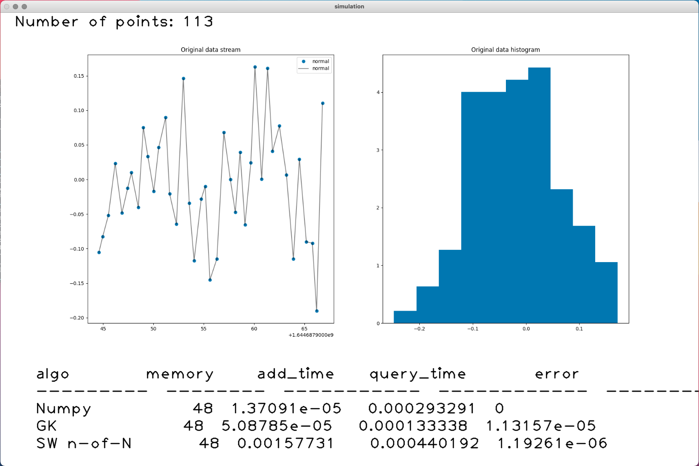
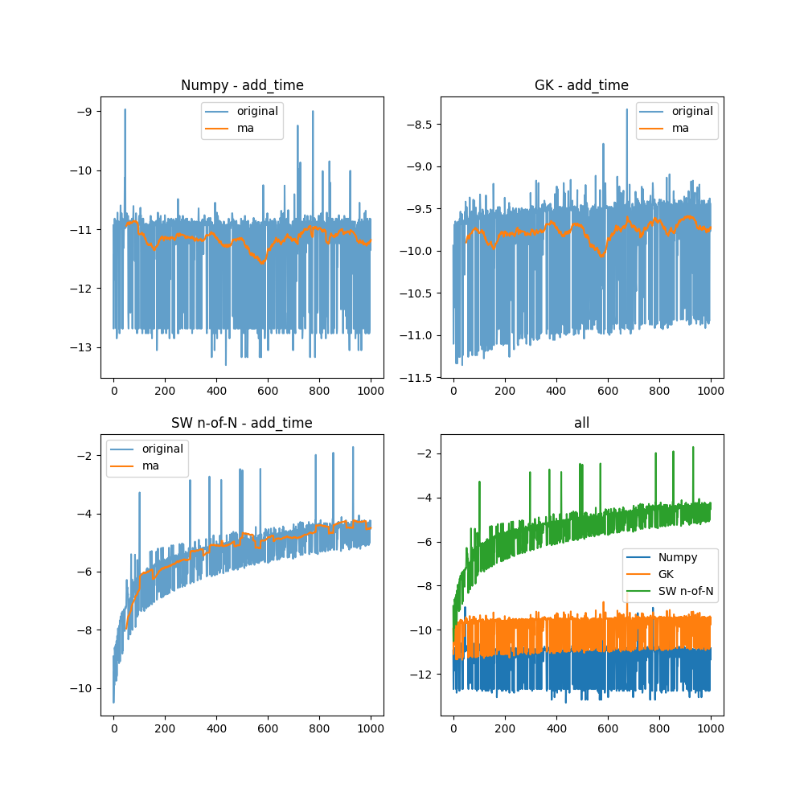
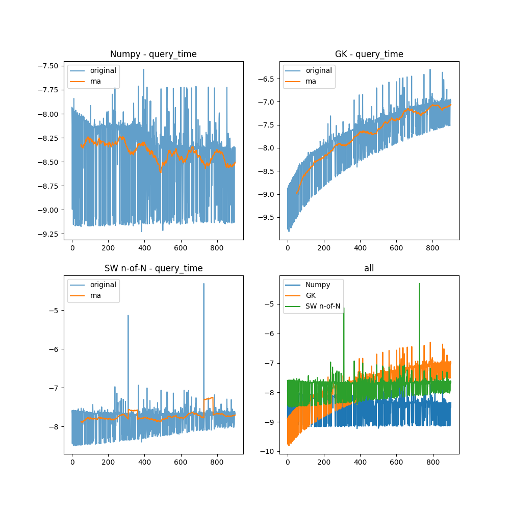
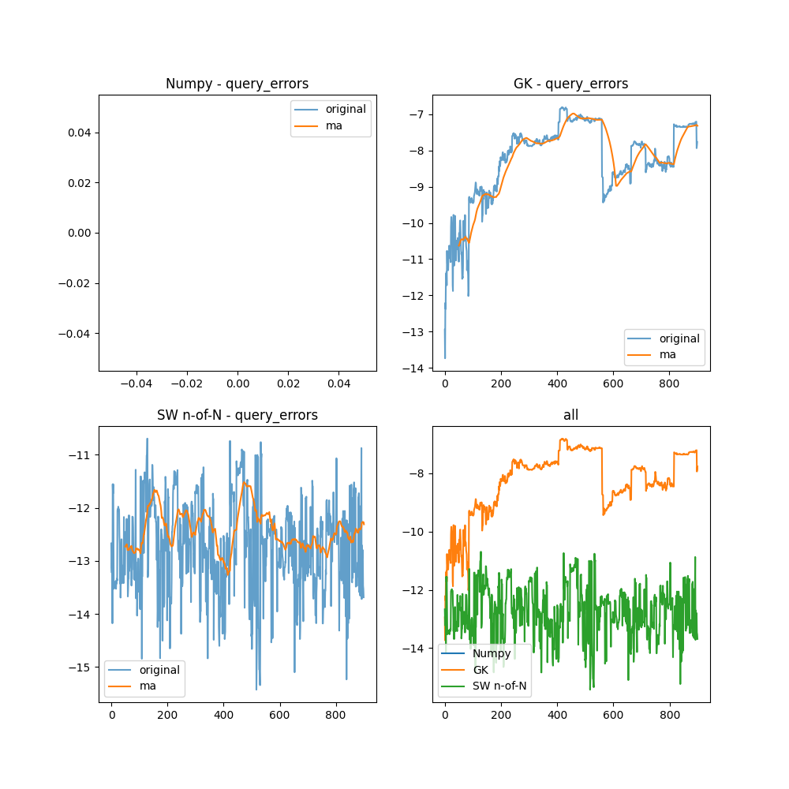

# SW n-of-N
## Method Description

### SW models
**GK01** is for computing quantiles over all arrived data. Sometimes quantiles of the most recent N elements in a stream are required. [Lin et al.](https://citeseerx.ist.psu.edu/viewdoc/download?doi=10.1.1.72.6192&rep=rep1&type=pdf) expanded **GK01** and proposed two algorithms for such case: **SW model** and **n-of-N model**.

**SW model** is for answering quantiles over the most recent $\N$ elements instantaneously, where $\N$ is predefined. The model puts the most recent $\N$ elements into several buckets in their arriving order. Rather than original elements, each buckets stores a *Summary* covering $\frac{\epsilon\N}{2}$ successive elements.

The distinction of **n-of-N model** is that it answers quantile queries instantaneously over the most recent $n$ elements where $n$ is any integer not larger than a predefined $\N$. It takes advantage of the **EH-partition** technique as shown in figure below.

### EH-partition

The technique classifies buckets, marking buckets at level $i$ as $i$−bucket whose $S$ covers all elements arriving since the bucket’s timestamp. There are at most $\lceil \frac{1}{\lambda} \rceil + 1$ buckets at each level, where $\lambda \in (0, 1)$. When a new element arrives, the model creates a $1$−bucket and sets its timestamp to the current timestamp. When the number of $i$−buckets reaches $\lceil \frac{1}{\lambda} \rceil + 2$, the two oldest buckets at level $i$ are merged into a $2i − bucket$ carrying the oldest timestamp iteratively until buckets at all levels are less than $\lceil \frac{1}{\lambda} \rceil + 2$. Because each bucket covers elements arriving since its timestamp, merging two buckets is equal to removing the later one.

-----

In order to guarantee that quantiles are $\epsilon$-approximate, $\lambda$ is set to $\frac{\epsilon}{\epsilon + 2}$. Each bucket preserves a $\frac{\epsilon}{2}$-approximate $S$. Quantiles are queried as follows:
1. Scan the bucket list until finding the first bucket $b$ making $N_b \le n$
2. Use LIFT to convert $S_b$ to a $\epsilon$-approximate $S$ covering $n$ elements
3. Search $S$ to find the quantile answer

The worst case space complexity is $O(\frac{1}{\epsilon^2}log^2(\epsilon N))$

> SW model description is taken from [here](https://ieeexplore.ieee.org/stamp/stamp.jsp?tp=&arnumber=9001104)

## Testing

To evaluate implemented algorithms, simulation system was created. It simulate normal distribution data and pass it into 3 different algorithms: SW n-of-N, GK and numpy.qunatile.

During the simulation you can observe the data that goes into the systems and metrics values (memory consumption, add time, query time, query error based on numpy data)

After the simulation, test system generate data report, the stores metrics for all algorithms. By calling `test/analyze_report.py` it is possible to plot all metrics along with its moving average.

### Add time

Numpy algorithm, obviously, is the fastest one, because smart people implemented it, not me. 
On the other hand, GK is much more faster than SW method.

The difference is that SW algorithm use EH-partition technique to store only $n$ last important values. Moreover, SW use GK for each bucket. 

### Query time

As we can see, SW and Numpy spend almost constant time for query and GK time is always growing. This happens, because number of points, that GK should process is also always growing. 

At start, GK query time is shorter than for SW, but later SW beats it.

### Query error

Error for SW is much more smaller than for GK, because SW only observes $n$ last point, so this behaviour was predictable. Good for you, SW n-of-N!
## Contacts:
* [Telegram](https://t.me/ma_evgor)